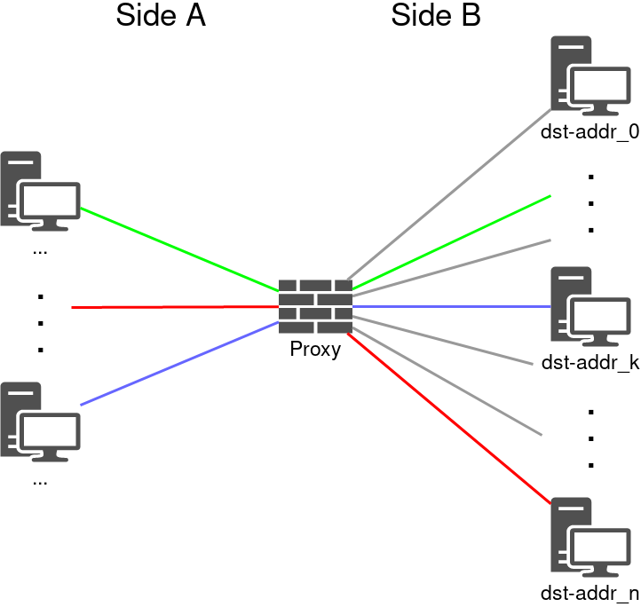
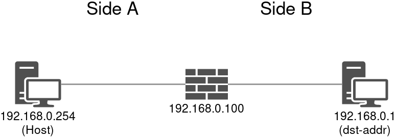
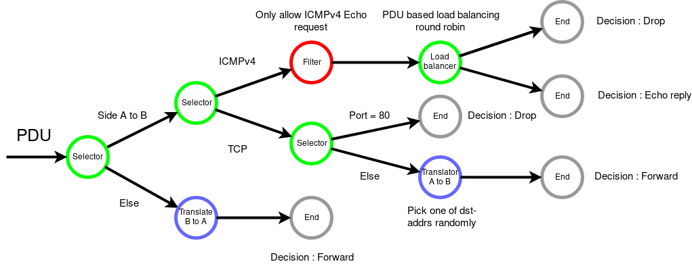

# Load balancing proxy

## Notes

You will need an extra device connected to the tap interface for this demo on top of the host machine. You can do this by booting up a LiveCD in a VM with network interface attached to the tap interface used below (tap100) for example.

## Build instructions

You need to pin the firewall-tree library at the moment as the library is not published to OPAM yet

You can do so with the following commands

```bash
opam pin add firewall-tree -k git https://gitlab.com/darrenldl/ocaml-firewall-tree.git
```

After installing `firewall-tree`, you can build the unikernel via

```bash
mirage configure -t hvt --ipv4=192.168.0.100
```

We're picking 192.168.0.100 for the network topology assumed in this demo

You also need to setup an appropriate network interface for running Solo5 based unikernels, you can read Solo5's network setup instructions [here](https://github.com/Solo5/solo5/blob/master/docs/building.md#setting-up)

We now build and run the unikernel with the following command

```bash
make depend # install other dependencies
make        # building the unikernel
./solo-hvt --net=tap100 proxy.hvt --dst-addrs=192.168.0.1
```

where tap100 is the interface established using Solo5's instructions

To communicate with the unikernel, we also need to add an IP to the tap interface on the host device. On Linux, this would look like

```bash
# ip addr add 192.168.0.254/24 dev tap100
```

adjust your firewall settings if necessary to allow input traffic from tap100

## Network

We've picked several IP addresses above, but we haven't explained the topology yet. Following shows the topology of the general case of this load balancing proxy



For n destination addresses specified through the `--dst-addrs` options, each incoming connection is mapped to one of the destionation address randomly

The library calls the unrestricted side "side A" and the load balanced side "side B". This naming convention is used for the translate functions provided by the library.

In this particular demo, we have the following topology



Now you might be wondering how translation works when everything's on the same subnet

Normally translation requires two network interfaces, each on a different subnet. We are using the same subnet here ~~because I don't know how to use Xen and Solo5 only supports one interface atm~~ to demonstrate the flexibility of the firewall-tree library. The strategy used in this demo is just to identify everything with source address matching any of the dst-addrs as side B to A traffic, and everything else as side A to B traffic. The relevant fragment of the code is shown below

```ocaml
select_first_match
  [| Not (IPv4_src_addr_one_of dst_addrs), ... (* A -> B *)
   ; True, ... (* B -> A *)
  |]
```

the order is flipped for clarity, obviously you are free to match the side B to A case first.

With the network topology in mind, let's examine the firewall tree

## Firewall policy

As the name suggests, the library enables you to specify your firewall policy in a tree form

We show the graphical version of the policy below. The code version used in unikernel is annotated with more low-level details, but is otherwise equivalent in logic.



To explain in text, essentially we want to reply to pings, but only every other ping packet, we block HTTP traffic very naively, and translate and forward all other TCP traffic to side B. Then for traffic from side B to A, we allow unconditionally.
